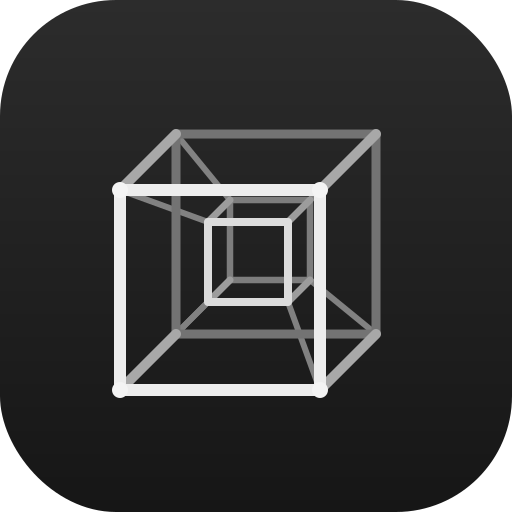

<p align="center">
  
</p>

<h1 align="center">Tesseract</h1>
<p align="center"><b>Post-quantum disk &amp; file encryption for the Linux desktop.</b></p>

[](https://www.rust-lang.org)
[](https://www.gtk.org)
[]()
[-89B4FA.svg)](https://csrc.nist.gov/pubs/fips/203/final)
[-89B4FA.svg)](https://csrc.nist.gov/pubs/fips/204/final)
[]()
[](https://www.rfc-editor.org/rfc/rfc9180)
[]()
[]()
[]()
[]()
[]()
[]()
[]()
[](LICENSE)

If this project helped you, please ⭐️ star it to help others find it.

---

## What is Tesseract?

Tesseract is a privilege-separated, post-quantum encryption tool for the Linux
desktop. Think VeraCrypt feature parity — encrypted containers, whole-disk
encryption, hidden volumes for plausible deniability — plus a simple file/folder
encryptor and a hardened background service that owns **every** key and never
hands one to the UI.

The interface is native GTK4 / libadwaita — not Electron, not a browser shell —
so it starts instantly and sits properly in your desktop. Everything runs
locally: no account, no network, no telemetry.

> [!IMPORTANT]
> Tesseract is **non-root by default**. The GUI and the key agent both run as
> your normal user. The default data plane (FUSE + udisks2) mounts encrypted
> volumes with no `sudo`, no setuid, and no polkit prompt for the device
> itself — exactly like plugging in a USB stick.

---

## Why "post-quantum"?

A "harvest now, decrypt later" attacker can record your encrypted data today and
decrypt it once a large quantum computer exists. Tesseract defends against this:

- **Volume keyslots** can require a **hybrid X25519 + ML-KEM-1024** keyslot, so
  unwrapping the master key needs both a classical *and* a lattice secret.
- **File encryption to a recipient** uses the same hybrid KEM through **HPKE
  (RFC 9180)**.
- **Attestation/signatures** use **ML-DSA-87** (optionally jointly with
  Ed25519).

The symmetric layer is already quantum-resistant: 256-bit ciphers in
length-preserving XTS, optionally cascaded up to five deep.

---

## Core Features

### Encrypt a file or folder
The simplest flow: pick a file — or a whole **folder** (packed into one
encrypted `.tsrf`) — set a **password**, and click Encrypt. Anyone with the
password can open it later. No keypair, no setup. Choose the cipher
(ChaCha20-Poly1305, AES-256-GCM, XChaCha20-Poly1305, AES-256-GCM-SIV, or a
two/three-layer cascade). Decryption restores the file, and folders extract
automatically.

### Encrypt to a recipient (public-key)
Switch to **Recipients** mode to encrypt to someone's public key instead of a
shared password — only they can open it. Built on HPKE with the hybrid
X25519 + ML-KEM-1024 KEM, multi-recipient, with an optional detached ML-DSA-87
signature. Generate and manage identities right in the app.

### Encrypted volumes
Create a container (file, partition, or device) you can **mount like a drive**.
The agent encrypts every read and write on the fly through the cascade engine,
in locked memory — plaintext never touches disk and the GUI never sees a key.
Pick the cipher cascade, hash, and Argon2id cost per volume.

### Hidden volumes (plausible deniability)
A deniable container can hold a hidden volume inside the free space of an outer
one. The whole header region is indistinguishable from random, so the presence
of a hidden volume is undecidable without its password. Hidden-volume protection
prevents the outer volume from overwriting the hidden one.

### Keyfiles & FIDO2 / YubiKey
Add keyfiles (with a built-in generator) or enrol a **FIDO2 security key** as a
keyslot via the CTAP2 `hmac-secret` extension — touch your YubiKey to unlock.

### Auto-dismount & panic
Volumes auto-lock and wipe their keys on screen lock, suspend, logout, fast
user switch, or inactivity (each configurable). A one-press **Panic** control
(or Ctrl+Shift+P) instantly locks everything and zeroizes all key material.

### Themes
Live-switching themes — **Dracula**, **Catppuccin** (Latte, Frappé, Macchiato,
Mocha), **Vintage Light**, **Neon Tessera** (cyberpunk), and follow-system —
each with a custom accent picker, density and motion controls, and HiDPI-crisp
rounded styling.

---

## How it works — privilege separation

| Component | Runs as | Holds keys? | Job |
|---|---|---|---|
| `tesseract-gui` | your user | **No** | Renders state, collects intent |
| `tesseract` (CLI) | your user | **No** | Scripting parity with the GUI |
| `tesseract-agent` | your user, sandboxed | **Yes (only here)** | All crypto, in locked non-dumpable memory |
| `tesseract-mountd` | `CAP_SYS_ADMIN` via polkit | No | *Optional* dm-crypt fast path only |

The GUI talks to the agent over a `0600` Unix socket, peer-credential checked.
Passphrases cross once as raw bytes straight into the agent's locked memory; the
agent runs the KDF and every cryptographic operation. Container references are
passed as file descriptors (never paths) to avoid TOCTOU.

The agent hardens itself at startup, in order: disable core dumps →
`mlockall` → open sockets/fds → **Landlock** filesystem restriction →
`no_new_privs` → **seccomp** syscall allowlist. The master key lives only in an
`mmap`'d guard-page arena, `mlock`'d and `MADV_DONTDUMP`'d, and is zeroized on
any wipe trigger.

---

## Cryptography

| Layer | Primitives |
|---|---|
| Sector data | XTS over AES-256, Serpent-256, Twofish-256, Camellia-256, ChaCha20/XChaCha20 — cascade depth 1–5 (experimental: Threefish-512, Kuznyechik, SM4, ARIA, Adiantum) |
| Keyslot sealing | Committing AEAD (derive-then-commit over XChaCha20-Poly1305 / AES-256-GCM-SIV) — a wrong key fails authentication, never yields a wrong master key |
| Key derivation | Argon2id (default), scrypt, PBKDF2-HMAC-SHA-512, Balloon (experimental); cost benchmarked at create time, PIM-style knob |
| Master-key wrapping | LUKS2-style keyslots: passphrase, hybrid PQC (X25519 + ML-KEM-1024), keyfile, FIDO2 hmac-secret |
| File mode | HPKE (RFC 9180) with hybrid KEM, chunked AEAD body with per-chunk binding, optional ML-DSA-87 / Ed25519 signature |
| Header integrity | Unkeyed BLAKE3 checksum verified **before** parse; VMK-keyed MAC after unlock; optional ML-DSA-87 attestation |
| Hashes | SHA-512, SHA-256, BLAKE3, BLAKE2b (experimental: Whirlpool, Streebog) |

All secret-dependent paths are constant-time; every cipher, KDF, KEM, and
signature ships with known-answer test vectors, and the header parser, keyslot
decoder, and IPC framer are fuzz targets.

> [!NOTE]
> Out of scope, by design: system/boot-drive encryption and pre-boot
> authentication. That needs kernel and bootloader integration outside a
> userspace non-root tool — use LUKS/dm-crypt for full-disk system encryption.

---

## Install

### Build from source

```bash
git clone https://github.com/jegly/tesseract
cd tesseract
cargo build --release -p tesseract-agent -p tesseract-cli -p tesseract-gui
packaging/install.sh          # user-scope install, no root
systemctl --user enable --now tesseract-agent
tesseract-gui                 # or: tesseract <subcommand>
```

`install.sh --system` does a system-wide install (needs sudo) and is only
required for the optional dm-crypt fast path's polkit helper.

### Requirements

- A GTK4 / libadwaita desktop session (Ubuntu and current stable kernels)
- `fuse3` and `udisks2` for the default (non-root) mount path
- Rust 1.85+ to build
- A FIDO2 authenticator is optional (build with `--features fido2`)

---

## Command line

The `tesseract` CLI has full parity with the GUI:

```bash
# encrypt a file or a whole folder with a password
tesseract file encrypt secret.pdf secret.pdf.tsrf --password
tesseract file encrypt ./my-folder folder.tsrf --password
tesseract file decrypt secret.pdf.tsrf out.pdf --password

# public-key file encryption
tesseract identity generate me.tsrid --seal
tesseract file encrypt report.txt report.tsrf --to <recipient-b64>

# volumes
tesseract create vault.tsr --size 2G --cascade aes,serpent --label work
tesseract mount vault.tsr
tesseract status
tesseract unmount <uuid>
tesseract panic
```

---

## Security & quality

| Mechanism | Detail |
|---|---|
| Privilege separation | GUI/CLI hold zero key material; the agent owns every key |
| Memory protection | Guard-page arenas, `mlockall`, `MADV_DONTDUMP`, zeroize-on-drop, core dumps disabled |
| Sandbox | Landlock + seccomp-bpf allowlist + `no_new_privs`, hardened `systemd --user` unit |
| IPC | `0600` Unix socket, `SO_PEERCRED` UID check, FD passing (no path TOCTOU) |
| Verify-before-parse | Header checksum checked before the CBOR decoder runs; bounded lengths/depth |
| Committing AEAD | Keyslots can never decrypt to a wrong master key |
| Emergency wipe | Auto-dismount on lock/suspend/logout/idle/socket-EOF/tamper; explicit Panic |
| Tested | KATs for every primitive, full round-trip + cascade-ordering tests, crash-safe in-place conversion, state-machine and fuzz targets |

---

## License

Licensed under the **GNU General Public License v3.0 or later**.
© jegly.

---

## Links

- [Tesseract repository](https://github.com/jegly/tesseract)
- [ML-KEM (FIPS 203)](https://csrc.nist.gov/pubs/fips/203/final)
- [ML-DSA (FIPS 204)](https://csrc.nist.gov/pubs/fips/204/final)
- [HPKE (RFC 9180)](https://www.rfc-editor.org/rfc/rfc9180)
